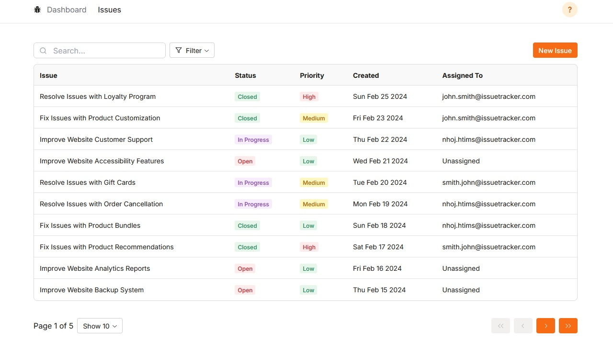

**Issue Tracker**
================


Issue Tracker is a web application designed to help teams track and manage issues, report bugs, and streamline their
development workflow. It provides a user-friendly interface for creating, assigning, and resolving issues, ensuring
effective collaboration and communication among team members.

**Table of Contents**
-----------------

* [Features](#features)
* [Technology Stack](#technology-stack)
* [Setup Instructions](#setup-instructions)
* [API Documentation](#api-documentation)
* [Frontend Features](#frontend-features)
* [Database](#database)
* [Authentication](#authentication)
* [Contributing](#contributing)

**Features**
------------

* Issue tracking and bug reporting
* Sorting, filtering, and pagination of issues
* User authentication using email and social authentication with Google OAuth 2
* API documentation using Swagger

**Technology Stack**
-------------------

* Backend: Django, Django Rest Framework, Djoser
* Frontend: Next.js, React Query, typescript
* UI: Tailwind, Radix UI
* Database: PostgreSQL

**Setup Instructions**
--------------------

1. Clone the repository using `git clone https://github.com/Hosseinht/django_issuetracker.git`

2. Navigate to the project directory:
   ```
   cd django_issuetracker
   ```

3. Set up the backend:
    - Navigate to the backend directory `cd backend`
    - Create a virtual environment and activate it.
    - Install the required dependencies using `pip install -r requirements_dev.txt`.
	- In the backend folder, rename .env.example to .env and set all the environment variables 
    - Configure the database settings in `settings/local.py`.
    - Apply the database migrations using `python manage.py migrate`.
    - Start the Django development server using `python manage.py runserver`.

4. Set up the frontend:
    - Navigate to the frontend directory using `cd frontend`.
    - Install the required dependencies using `npm install` or `yarn install`.
	- In the frontend folder, rename .env.example to .env
    - Start the Next.js development server using `npm run dev`.

5. Access the application:
    - Open your web browser and visit `http://localhost:3000` to access the Issue Tracker application.

**API Documentation**
-------------------

The API documentation can be accessed
at [http://127.0.0.1:8000/api/schema/swagger-ui/](http://127.0.0.1:8000/api/schema/swagger-ui/)

**Frontend Features**
-------------------

* Dashboard: The application provides a dashboard, displaying latest issues, issue chart and key metrics.
* Issue Assignment: Users can assign issues to themselves or other team members, facilitating effective collaboration
  and task allocation.
* Sorting: Issues can be sorted by title, description, status, creation date and assigned users
* Filtering: Issues can be filtered by status
* Pagination: Issues are paginated
* Authentication: Users can authenticate using email and social authentication with Google OAuth 2

**Database**
------------

The application uses a PostgreSQL database

**Authentication**
----------------

The application uses Djoser for authentication. Users can authenticate using email and social authentication with Google
OAuth 2.
For security purposes, authentication tokens are stored in HttpOnly cookies. This approach helps prevent cross-site
scripting (XSS) attacks by ensuring that the tokens are not accessible via JavaScript.


**Contributing**
---------------

Contributions are welcome! If you'd like to contribute to the project, please fork the repository and submit a pull
request.